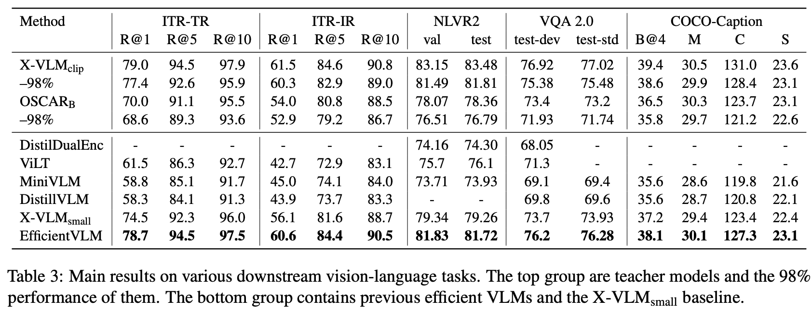

# EfficientVLM: Fast and Accurate Vision-Language Models via Distillation and Modal-adaptive Pruning

**Code Will Be Released SOON**

## Main Results

<div align="center">
  
</div>

## Features
- Support apex O1 / O2 for pre-training
- Read from and write to HDFS
- Distributed training across nodes for both general distillation stage and modal-adaptive pruning stage

Please read the code for more details. 


## Requirements
- Install python3 environment
```angular2html
pip install -r requirements.txt
```
- Download raw images from corresponding websites
- Download the json files we provided, which contains image read paths and captions and/or bbox annotations
- If running pre-training scripts: 
  - install Apex
  - download pre-trained models for parameter initialization 
    - image encoder: [clip-vit-base](https://huggingface.co/openai/clip-vit-base-patch16/tree/main)
    - text encoder: [bert-base](https://huggingface.co/bert-base-uncased/tree/main)
- Organize these files like this (% is for pre-training only):  
```angular2html
EfficientVLM/
    data/
        finetune/
            refcoco+/*.json
            *.json
        
        %pretrain_4m_base/*.json
        	%model_state_step_199999.pth
        %pretrain_4m_small/*.json
        	%half_teacher.pth
        %bert-base-uncased/
            config.json
            pytorch_model.bin
            tokenizer_config.json
            tokenizer.json
            vocab.txt
        %clip-vit-base-patch16.bin
    images/
        coco/
            train2014/*.jpg
            val2014/*.jpg
            test2015/*.jpg
        
        visualgenome/
            image/*.jpg
        
        nlvr2/
            images/
                train/0-99/*.png
            dev/*.png
            test1/*.png
        
        %sbu/*.jpg
        %cc-3m/*.jpg
```


## General Distillation Stage
```angular2html
# pretrain with general disitillation
python run.py --task "gd_4m_small" --dist "1" --output_dir "output/gd_4m" --teacher_chkpt "PATH_TO_TEACHER_CHECKPOINT"
# if using >2 nodes for general distillation:
python run.py --task "gd_4m_small" --dist "all" --output_dir "output/gd_4m" --teacher_chkpt "PATH_TO_TEACHER_CHECKPOINT"
```
For other arguments like --epoch, --seed etc., see run.py for more details.


#### Data
Please prepare your own datasets. Read the code dataset/pretrain_dataset.py to see what format is needed. 

#### Checkpoints
[X-VLM(clip_vit) Teacher (4M)](https://drive.google.com/file/d/1y3aKP6EugfiWE2xosPL5Q166J0XetDvn/view?usp=sharing) 


## Finetune
Datasets for finetuning can be downloaded in following links. 

#### Data 
[download json files](https://drive.google.com/file/d/1XFz1Vtz7MCBLn4_1QEojhFJ5Iw3eH3X4/view?usp=sharing) 

#### Python CLI of Modal-adaptive pruning in the fine-tuning stage
```angular2html
# VQA
python run.py --dist '1' --task 'vqa_480' --output_dir output/vqa_480 --checkpoint PATH/TO/GD_CHECKPOINT --teacher_chkpt PATH/TO/TEACHER_VQA_CHECKPOINT

#ITR-COCO 
python run.py --task "itr_coco" --dist "1" --output_dir "output/itr_coco" --checkpoint PATH/TO/GD_CHECKPOINT --teacher_chkpt PATH/TO/TEACHER_ITR_CHECKPOINT 

# NLVR (post-pretrain (no KD required)& finetuning and pruning)
python run.py --task "nlvr_domain" --dist "1" --output_dir "output/nlvr_domain" --checkpoint PATH/TO/GD_CHECKPOINT --teacher_chkpt PATH/TO/TEACHER_NLVR_CHECKPOINT 

# COCO Captioning (post-pretrain (no KD required)& finetuning and pruning)
python run.py --task "coco_capt_domain" --dist "1" --output_dir "output/coco_capt_domain" --checkpoint PATH/TO/GD_CHECKPOINT --teacher_chkpt PATH/TO/TEACHER_CAPTION_CHECKPOINT 
```
Our code and scripts are based on [X-VLM](https://github.com/zengyan-97/X-VLM) and [CoFiPruning](https://github.com/princeton-nlp/CoFiPruning). We thank the authors for opening source their code.


## Citation
If you find this repository useful, please considering giving ⭐ or citing:
```


```

### Contact
For issues or help using this code, please submit a GitHub issue.